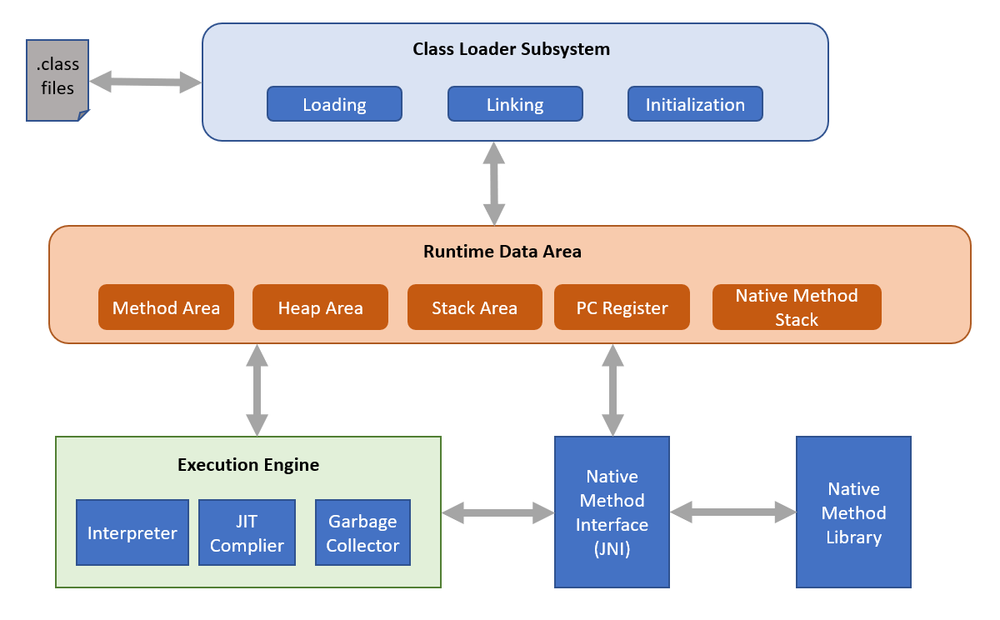

# BCA Second Semester
# Object Oriented Programming in Java
## Unit 1: Introduction to Java and OOP Concepts

## Table of Contents
1. [History, Features and Buzzwords of Java](#1-history-features-and-buzzwords-of-java)
2. [Java Architecture, JVM, JDK and JRE](#2-java-architecture-jvm-jdk-and-jre)
3. [Procedural Oriented vs Object Oriented Programming](#3-procedural-oriented-vs-object-oriented-programming)
4. [Sample Java Program](#4-sample-java-program)
5. [Compiling and Running the Java Program](#5-compiling-and-running-the-java-program)
6. [Command Line Arguments](#6-command-line-arguments)
7. [Scanner Class for Input](#7-scanner-class-for-input)
8. [Handling Common Errors](#8-handling-common-errors)
---

## 1. History, Features and Buzzwords of Java
 
### 1.1 History of Java
 
- Java was developed by **James Gosling** and his team (called the **Green Team**) at **Sun Microsystems** in **1991**.
- Originally named **"Oak"** (after an oak tree outside Gosling's office), later renamed **"Green"**, and finally **"Java"** in **1995** (named after Java coffee, popular in Indonesia).
- It was originally designed for **programming consumer electronic devices** (set-top boxes, TVs) but later found its true use in **Internet programming**.
- Java 1.0 was released publicly in **1995** by Sun Microsystems.
- In **2010, Oracle Corporation** acquired Sun Microsystems and now owns and maintains Java.
- Nepal's IT industry (banking software, e-governance systems like PAN registration, university ERP systems, mobile banking backends) widely uses Java (especially Java EE/Spring) because it is platform-independent, secure, and enterprise-ready.
```
1991 -> Project "Oak" started (James Gosling, Sun Microsystems)
1995 -> Renamed to "Java", Java 1.0 released
2004 -> Java 5 (Generics, Enhanced for-loop, Autoboxing)
2010 -> Oracle acquires Sun Microsystems
2014 -> Java 8 (Lambda expressions, Streams)
2017+ -> New release cycle: a new version every 6 months
```
### 1.2 Features / Buzzwords of Java
 
Java's official specification lists a set of **buzzwords** that describe its features:
 
| Buzzword | Explanation |
|---|---|
| **Simple** | Syntax is based on C++ but removes complex features like pointers, operator overloading, multiple inheritance (via classes) making it easier to learn. |
| **Object Oriented** | Everything in Java (except primitives) is treated as an object, supporting encapsulation, inheritance, polymorphism, abstraction. |
| **Platform Independent** | Java follows **"Write Once, Run Anywhere" (WORA)**. Compiled code (bytecode) can run on any machine with a JVM. |
| **Secure** | No explicit pointers, programs run inside a "sandbox," bytecode verifier checks code before execution. |
| **Robust** | Strong memory management, automatic **garbage collection**, exception handling, and type checking at compile time reduce program crashes. |
| **Architecture Neutral** | Compiler generates bytecode which is not tied to any specific processor architecture. |
| **Portable** | Since it is architecture-neutral and has no implementation-dependent features, Java programs are portable across systems. |
| **High Performance** | Bytecode is close to native code and is optimized via **Just-In-Time (JIT) compiler**. |
| **Distributed** | Java has extensive support for networking (`java.net` package), and technologies like RMI, and web services for building distributed applications. |
| **Multithreaded** | Java can perform many tasks simultaneously using threads, useful in banking transaction systems, chat servers, etc. |
| **Dynamic** | Java programs carry a lot of run-time information that can verify and resolve access to objects at run time. |
| **Interpreted** | The JVM interprets bytecode instruction by instruction (along with JIT compilation for speed). |

**Memory tip (acronym style used commonly):**
> **"SOPS RAP HDM"** — Simple, Object-Oriented, Platform Independent, Secure, Robust, Architecture Neutral, Portable, High Performance, Distributed, Multithreaded, Dynamic *(you can rearrange to form your own mnemonic for exams)*
 
---

# 2. Java Architecture, JVM, JDK and JRE
 
### 2.1 Definitions
 
- **JVM (Java Virtual Machine):** An abstract machine that provides a runtime environment to execute Java bytecode. It is platform-**dependent** (a different JVM exists for Windows, Linux, Mac) but makes Java **platform-independent** at the code level.
- **JRE (Java Runtime Environment):** A software package that provides the **JVM + libraries (class libraries) + other supporting files** needed to **run** Java applications. It does **not** contain a compiler.
- **JDK (Java Development Kit):** A software package that includes **JRE + development tools** (compiler `javac`, debugger, `javadoc`, `jar`, etc.) needed to **develop and compile** Java applications.
### 2.2 Relationship Diagram
 
```
 ┌────────────────────────────────────────────────┐
 │                     JDK                        │
 │   (Java Development Kit)                       │
 │   - javac (compiler), javadoc, jar, debugger   │
 │  ┌───────────────────────────────────────────┐ │
 │  │                  JRE                      │ │
 │  │        (Java Runtime Environment)         │ │
 │  │   - Class Libraries (java.lang, java.util)│ │
 │  │  ┌──────────────────────────────────────  │ │
 │  │  │                 JVM                    │ │ 
 │  │  │        (Java Virtual Machine)          │ │ 
 │  │  │  - Class Loader                        │ │ 
 │  │  │  - Bytecode Verifier                   │ │ 
 │  │  │  - Execution Engine (Interpreter/JIT)  │ │ 
 │  │  └─────────────────────────────────────── ┘ │ 
 │  └───────────────────────────────────────────┘ │
 └────────────────────────────────────────────────┘
```
 
### 2.3 Java Program Execution Architecture (Compilation + Execution Flow) - JVM Architecure
 


 
### 2.4 Components of JVM (brief)
 
| Component | Role |
|---|---|
| **Class Loader** | Loads `.class` files into memory |
| **Method Area** | Stores class-level data (static variables, method code) |
| **Heap** | Stores objects created at runtime |
| **Stack** | Stores method call frames, local variables |
| **Program Counter (PC) Register** | Holds the address of currently executing instruction |
| **Execution Engine** | Executes bytecode (Interpreter + JIT Compiler + Garbage Collector) |
| **Native Method Interface (JNI)** | Allows interaction with native (C/C++) libraries |
 

---
 
## 3. Procedural Oriented vs Object Oriented Programming
 
### 3.1 Definitions
 
- **Procedural Oriented Programming (POP):** A programming paradigm based on the concept of **procedure calls**, where a program is divided into a set of **functions/procedures**. Data and functions are separate. Example languages: C, Pascal, FORTRAN.
- **Object Oriented Programming (OOP):** A programming paradigm based on the concept of **objects**, which bundle **data (attributes)** and **behavior (methods)** together. Example languages: Java, C++, Python.
### 3.2 Diagram: Structural Difference
 
```
PROCEDURAL PROGRAMMING                 OBJECT ORIENTED PROGRAMMING
─────────────────────────             ─────────────────────────────
        main()                                  Object 1
       /   |   \                              ┌───────────┐
      /    |    \                             │ Data      │
 func1() func2() func3()                      │ Methods   │
      \    |    /                             └───────────┘
       \   |   /                                    │
     Global Data (shared)                     interacts with
                                                      │
                                               Object 2
                                              ┌───────────┐
                                              │ Data      │
                                              │ Methods   │
                                              └───────────┘
```
 
### 3.3 Key Differences
 
| Basis | Procedural Programming | Object Oriented Programming |
|---|---|---|
| **Approach** | Top-down approach | Bottom-up approach |
| **Basic unit** | Function/Procedure | Object (Class) |
| **Data security** | Data is global, less secure | Data is encapsulated (private), more secure |
| **Data & function relation** | Data and functions are separate | Data and functions are bound together (encapsulation) |
| **Emphasis** | Emphasis on doing things (algorithm) | Emphasis on data |
| **Code reusability** | Limited (via functions only) | High, via **inheritance** |
| **Overloading** | Not supported | Supported (method/constructor overloading) |
| **Real world mapping** | Difficult to map real-world problems | Easy to map real-world entities as objects |
| **Examples** | C, Pascal, FORTRAN, COBOL | Java, C++, C#, Python |
 
### 3.4 Four Pillars (Basic Concepts) of OOP
 
| Concept | Definition | Simple Example |
|---|---|---|
| **Encapsulation** | Wrapping data and methods into a single unit (class) and restricting direct access using access modifiers (`private`) | A `BankAccount` class hides the `balance` variable and exposes `deposit()`/`withdraw()` methods |
| **Inheritance** | A mechanism where a new class (child/subclass) acquires properties of an existing class (parent/superclass) | `SavingsAccount` inherits from `Account` |
| **Polymorphism** | Ability of an object to take many forms — same method behaves differently (overloading/overriding) | `calculateInterest()` behaves differently for `SavingsAccount` vs `FixedDepositAccount` |
| **Abstraction** | Hiding internal implementation details and showing only essential features | Using an ATM machine without knowing internal processing logic |
 
---
 
## 4. Sample Java Program
 
### 4.1 A Simple "Hello World" Program
 
```java
// File name: Main.java
public class Main {
    public static void main(String[] args) {
        System.out.println("Welcome to BCA OOP in Java.");
    }
}
```
 
### 4.2 Explanation of Each Line
 
| Code | Explanation |
|---|---|
| `public class Main` | Declares a public class named `Main`. The file name **must match** the public class name exactly (`Main.java`). |
| `public static void main(String[] args)` | The **main method** — entry point of every Java application. JVM starts execution from here. |
| `public` | Access modifier — accessible from anywhere |
| `static` | Means the method belongs to the class, not an instance; JVM can call it without creating an object |
| `void` | Return type — main returns nothing |
| `String[] args` | Array to hold command-line arguments |
| `System.out.println(...)` | Prints text to console followed by a new line |
 
### 4.3 A Slightly Bigger Example — Class with Object
```java
// File name: StudentRecord.java
public class StudentRecord {
    // Data members (fields)
    String name;
    int rollNo;
    double marks;
 
    // Method to display data
    void display() {
        System.out.println("Name    : " + name);
        System.out.println("Roll No : " + rollNo);
        System.out.println("Marks   : " + marks);
    }
 
    public static void main(String[] args) {
        // Creating object
        StudentRecord s1 = new StudentRecord();
        s1.name = "Alpha alpha";
        s1.rollNo = 12;
        s1.marks = 78.5;
 
        s1.display();
    }
}
```
 
**Output:**
```
Name    : Alpha alpha
Roll No : 12
Marks   : 78.5
```
 
---
 
## 5. Compiling and Running the Java Program
 
### 5.1 Steps (using command prompt / terminal)
 
Assume the file is `Main.java` saved in a folder, e.g., `D:\BCA\Java\`.
 
**Step 1: Open Command Prompt/Terminal and navigate to the folder**
```bash
cd D:\BCA\Java
```
 
**Step 2: Compile the program** (creates `Main.class` bytecode file)
```bash
javac Main.java
```
 
**Step 3: Run the program**
```bash
java Main
```
> Note: While compiling we use the file name **with** `.java` extension, but while running we use only the **class name without any extension**.
 
### 5.2 Diagram of the Process
 
```
  Main.java  ── javac Main.java ──►  Main.class (bytecode)
                                                        │
                                                java Main
                                                        ▼
                                                 JVM loads & executes
                                                        │
                                                        ▼
                                          Output printed on console
```
 
<!-- ### 5.3 Common Compilation Notes
 
- `javac` is the **compiler** (part of JDK) — converts `.java` → `.class`.
- `java` is the **launcher** that starts the JVM and runs the bytecode.
- If the class is inside a **package**, e.g., `package np.edu.bca;`, then:
  - Compile: `javac -d . Main.java`
  - Run: `java np.edu.bca.Main` -->
### 5.4 Using an IDE
 
Using **Eclipse**, **NetBeans**, **IntelliJ IDEA**, or **VS Code with Java Extension Pack** allow students to simply click **Run**, which internally performs the same `javac` + `java` steps.
 
---
 
## 6. Command Line Arguments
 
### 6.1 Definition
 
**Command Line Arguments** are the values/information passed to a Java program at the time of running it from the command line. They are stored in the `String[] args` parameter of the `main()` method.
 
### 6.2 Example Program
 
```java
// File name: CommandLineDemo.java
public class CommandLineDemo {
    public static void main(String[] args) {
        System.out.println("Total arguments passed: " + args.length);
 
        for (int i = 0; i < args.length; i++) {
            System.out.println("Argument " + i + ": " + args[i]);
        }
    }
}
```
 
### 6.3 Compiling and Running with Arguments
 
```bash
javac CommandLineDemo.java
java CommandLineDemo Bsc.CSIT BCA BIT
```
 
**Output:**
```
Total arguments passed: 3
Argument 0: Bsc.CSIT
Argument 1: BCA
Argument 2: BIT
```
 
### 6.4 Example: Adding Two Numbers via Command Line
 
```java
public class AddNumbers {
    public static void main(String[] args) {
        if (args.length != 2) {
            System.out.println("Usage: java AddNumbers <num1> <num2>");
            return;
        }
        int a = Integer.parseInt(args[0]);
        int b = Integer.parseInt(args[1]);
        System.out.println("Sum = " + (a + b));
    }
}
```
 
Run as:
```bash
java AddNumbers 15 25
```
**Output:**
```
Sum = 40
```
 
> **Key Point:** All command line arguments are received as **String** by default. To use them as numbers, they must be converted using methods like `Integer.parseInt()` or `Double.parseDouble()`.
 
---
 
## 7. Scanner Class for Input
 
### 7.1 Definition
 
`Scanner` is a class found in the `java.util` package used to read **input from the user** (keyboard) during program execution. It is the most common way to take dynamic input in Java (similar to `cin` in C++ or `input()` in Python).
 
### 7.2 Steps to Use Scanner
 
1. Import the package: `import java.util.Scanner;`
2. Create an object: `Scanner sc = new Scanner(System.in);`
3. Call the appropriate method to read input.
### 7.3 Common Scanner Methods
 
| Method | Purpose |
|---|---|
| `nextInt()` | Reads an integer value |
| `nextDouble()` | Reads a double value |
| `nextFloat()` | Reads a float value |
| `nextLong()` | Reads a long value |
| `next()` | Reads a single word (String, stops at whitespace) |
| `nextLine()` | Reads a full line of text (including spaces) |
| `nextBoolean()` | Reads a boolean value (true/false) |
| `hasNext()` | Checks whether more input is available |
 
### 7.4 Example Program (Grocery Store Bill)
 
```java
import java.util.Scanner;
 
public class KiranaBill {
    public static void main(String[] args) {
        Scanner sc = new Scanner(System.in);
 
        System.out.print("Enter customer name: ");
        String name = sc.nextLine();
 
        System.out.print("Enter quantity of rice (kg): ");
        double qty = sc.nextDouble();
 
        System.out.print("Enter price per kg (Rs.): ");
        double price = sc.nextDouble();
 
        double total = qty * price;
 
        System.out.println("\n----- Bill -----");
        System.out.println("Customer : " + name);
        System.out.println("Total Amount : Rs. " + total);
 
        sc.close();
    }
}
```
 
**Output:**
```
Enter customer name: Ramesh Thapa
Enter quantity of rice (kg): 5
Enter price per kg (Rs.): 90
 
----- Bill -----
Customer : Ramesh Thapa
Total Amount : Rs. 450.0
```
 
### 7.5 Important Caution: Mixing `nextInt()`/`nextDouble()` with `nextLine()`
 
A very common error for beginners:
 
```java
Scanner sc = new Scanner(System.in);
System.out.print("Enter age: ");
int age = sc.nextInt();     // leaves a "\n" (newline) in the buffer
 
System.out.print("Enter name: ");
String name = sc.nextLine(); // This will read an EMPTY string!
```
 
**Fix:** Add an extra `sc.nextLine();` after `nextInt()`/`nextDouble()` to consume the leftover newline character, or use `next()` instead of `nextLine()` if a single word is enough.
 
```java
int age = sc.nextInt();
sc.nextLine();          // consumes leftover newline
String name = sc.nextLine();
```
 
---
 
## 8. Handling Common Errors
 
Java errors fall broadly into three categories. Understanding these helps in debugging efficiently — a very important exam and practical topic.
 
### 8.1 Categories of Errors
 
```
                Errors in Java
                       │
     ┌─────────────────┼─────────────────┐
     │                 │                 │
Compile-Time      Run-Time            Logical
   Errors          Errors (Exceptions)  Errors
```
 
| Type | Definition | When it occurs | Example |
|---|---|---|---|
| **Compile-Time Error (Syntax Error)** | Errors detected by the compiler before the program runs, due to violation of language grammar/rules | During `javac` compilation | Missing semicolon, mismatched braces, misspelled keyword |
| **Run-Time Error (Exception)** | Errors that occur while the program is running, causing abnormal termination if not handled | During `java` execution | Division by zero, accessing invalid array index, null reference |
| **Logical Error** | The program compiles and runs but produces **wrong output** because the logic/algorithm is incorrect | Anytime — hardest to detect since no error message is shown | Using `+` instead of `*` in a formula |
 
### 8.2 Compile-Time Error Example
 
```java
public class Demo {
    public static void main(String[] args) {
        System.out.println("Hello")   // missing semicolon
    }
}
```
**Compiler Output:**
```
Demo.java:3: error: ';' expected
        System.out.println("Hello")
                                    ^
1 error
```
 
### 8.3 Run-Time Error Example (Exception)
 
```java
public class DivideDemo {
    public static void main(String[] args) {
        int a = 10, b = 0;
        System.out.println(a / b);  // ArithmeticException
    }
}
```
**Output:**
```
Exception in thread "main" java.lang.ArithmeticException: / by zero
        at DivideDemo.main(DivideDemo.java:4)
```
 
### 8.4 Handling Run-Time Errors using try-catch
 
```java
public class DivideDemoSafe {
    public static void main(String[] args) {
        int a = 10, b = 0;
        try {
            int result = a / b;
            System.out.println("Result: " + result);
        } catch (ArithmeticException e) {
            System.out.println("Error: Cannot divide by zero!");
        } finally {
            System.out.println("Execution completed.");
        }
    }
}
```
**Output:**
```
Error: Cannot divide by zero!
Execution completed.
```
 
### 8.5 Common Exceptions Table (Frequently Faced by Beginners)
 
| Exception | Cause |
|---|---|
| `ArithmeticException` | Division by zero |
| `NullPointerException` | Trying to use an object reference that is `null` |
| `ArrayIndexOutOfBoundsException` | Accessing an array index that doesn't exist |
| `NumberFormatException` | Invalid conversion, e.g., `Integer.parseInt("abc")` |
| `InputMismatchException` | Entering wrong data type in `Scanner` (e.g., text when `nextInt()` expected) |
| `ClassNotFoundException` | JVM cannot find the specified class at runtime |
| `FileNotFoundException` | Trying to access a file that does not exist |
 
### 8.6 Logical Error Example
 
```java
public class AreaDemo {
    public static void main(String[] args) {
        double radius = 5;
        double area = 2 * 3.14 * radius; // WRONG formula (this is circumference)
        System.out.println("Area: " + area);
    }
}
```
This compiles and runs without any error message, but the **output is logically wrong** because the correct formula for area should be `3.14 * radius * radius`. Logical errors are found only through careful testing and tracing.
 
### 8.7 Summary Diagram: try-catch-finally Flow
 
```
          ┌───────────────┐
          │   try block   │
          │ (risky code)  │
          └───────┬───────┘
                  │
        Exception occurs? 
           │            │
          Yes           No
           │            │
   ┌───────▼──────┐     │
   │  catch block  │    │
   │ (handle error)│    │
   └───────┬──────┘     │
           │            │
           └─────┬──────┘
                 ▼
         ┌───────────────┐
         │ finally block │
         │ (always runs) │
         └───────────────┘
```
 
---
 
## Quick Revision Summary (Unit 1)
 
- Java: created by James Gosling (1991, Sun Microsystems), platform-independent via bytecode + JVM.
- **JDK = JRE + Development tools**, **JRE = JVM + Libraries**.
- POP focuses on functions/procedures; OOP focuses on objects combining data + behavior.
- Every Java program needs a `main()` method as entry point.
- `javac` compiles `.java` to `.class`; `java` runs the bytecode via JVM.
- Command line arguments (`String[] args`) allow passing data at runtime, always received as String.
- `Scanner` class (`java.util.Scanner`) is used for taking keyboard input.
- Errors: Compile-time (syntax), Run-time (exceptions, handled by try-catch), Logical (wrong output despite no error).
---