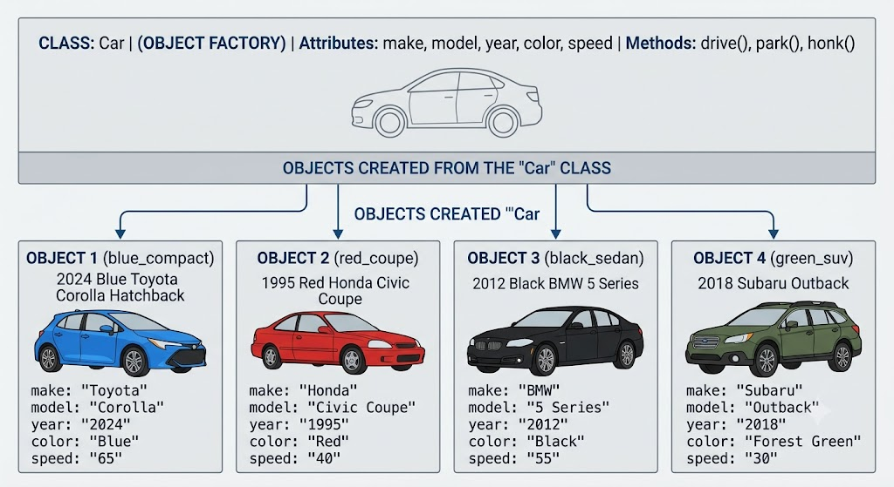

# Unit 3: Class and Objects in Java
 
## Table of Contents (Unit 3)
1. [Defining Class, Adding Methods, Creating Objects, Calling Methods](#31-defining-class-adding-method-to-class-creating-object-and-calling-functionmethod)
2. [Abstraction and Encapsulation](#32-abstraction-and-encapsulation)
3. [Constructors and its Types](#33-constructors-and-its-type)
4. [`this` Keyword](#34-this-keyword)
5. [Static Fields and Methods](#35-static-fields-and-methods)
6. [Passing by Value / by Reference](#36-more-on-method-passing-by-value-by-reference)
7. [Recursion](#37-recursion)
8. [Nested and Inner Class](#38-nested-and-inner-class)
9. [Variable Length Arguments](#39-variable-length-arguments)
10. [Package: Defining and Importing](#310-package-defining-and-importing-package)
---
 
## 3.1 Defining Class, Adding Method to Class, Creating Object and Calling Function/Method
 
**Class:** A blueprint/template that defines the properties (fields) and behaviors (methods) of objects.
**Object:** A real-world instance of a class, created using the `new` keyword, occupying memory in the heap.


 
### Example (Bank Account)
 
```java
public class BankAccount {
    // Fields (data members) / (attributes)
    String accHolder;
    double balance;
 
    // Method
    void deposit(double amount) {
        balance = balance + amount;
        System.out.println("Rs. " + amount + " deposited. New balance: Rs. " + balance);
    }
 
    public static void main(String[] args) {
        BankAccount acc = new BankAccount();   // creating object
        acc.accHolder = "Alpha alpha";
        acc.balance = 5000;
 
        acc.deposit(1500);   // calling method
    }
}
```
 
**Output:**
```
Rs. 1500.0 deposited. New balance: Rs. 6500.0
```
 
### Diagram: Class vs Object
 
```
      CLASS (Blueprint)                    OBJECTS (Instances)
   ┌────────────────────┐           ┌───────────────┐ ┌────────────────┐
   │   BankAccount      │           │ acc1          │ │ acc2           │
   │ - accHolder        │────new──► │ Alpha alpha   │ │ Beta beta      │
   │ - balance          │           │ Rs. 6500      │ │ Rs. 12000      │
   │ + deposit()        │           └───────────────┘ └────────────────┘
   └────────────────────┘
```
 
---
 
## 3.2 Abstraction and Encapsulation
 
*(Refer also to Unit 1, Section 3.4 for basic definitions)*
 
### Encapsulation — Implementation Example
 
Encapsulation is achieved using **private fields** and **public getter/setter methods**.
 
```java
public class Employee {
    private String name;     // private – hidden from outside
    private double salary;
 
    public void setName(String name) { this.name = name; }
    public String getName() { return name; }
 
    public void setSalary(double salary) {
        if (salary > 0) this.salary = salary;   // validation possible due to encapsulation
    }
    public double getSalary() { return salary; }
}
```
 
### Abstraction — Implementation Example
 
Abstraction is achieved using **abstract classes** or **interfaces** (details in Unit 4), hiding implementation and showing only essential functionality.
 
```java
abstract class Vehicle {
    abstract void startEngine();   // abstract method – no body, only declaration
}
 
class Motorbike extends Vehicle {
    void startEngine() {
        System.out.println("Motorbike engine started with self-start button.");
    }
}
```
 
### Difference: Abstraction vs Encapsulation
 
| Basis | Abstraction | Encapsulation |
|---|---|---|
| Focus | Hides implementation, shows only functionality ("what") | Hides internal data, protects it ("how it's stored/accessed") |
| Achieved by | Abstract class, Interface | Access modifiers (`private`) + getters/setters |
| Level | Design level | Implementation level |
| Example | Driving a car without knowing engine mechanics | ATM hides account balance variable, exposes only `getBalance()` |
 
---
 
## 3.3 Constructors and its Type (Default, Parameterized and Copy)
 
**Definition:** A constructor is a special method used to **initialize objects**. It has the **same name as the class**, has **no return type** (not even `void`), and is automatically called when an object is created using `new`.
 
### 3.3.1 Default Constructor
A no-argument constructor, either provided automatically by Java (if none is defined) or written explicitly, that assigns default values.
 
```java
public class Student {
    String name;
    int age;
 
    // Default constructor
    Student() {
        name = "Unknown";
        age = 0;
    }
 
    public static void main(String[] args) {
        Student s1 = new Student();  // default constructor called automatically
        System.out.println(s1.name + " " + s1.age);
    }
}
```
 
### 3.3.2 Parameterized Constructor
Accepts arguments to initialize an object with specific values at the time of creation.
 
```java
public class Student2 {
    String name;
    int age;
 
    Student2(String n, int a) {   // parameterized constructor
        name = n;
        age = a;
    }
 
    public static void main(String[] args) {
        Student2 s1 = new Student2("Alpha alpha", 20);
        System.out.println(s1.name + " " + s1.age);
    }
}
```
 
### 3.3.3 Copy Constructor
Java does **not provide a built-in copy constructor** (unlike C++), but the programmer can write one manually to create a new object by copying values from an existing object.
 
```java
public class Student3 {
    String name;
    int age;
 
    Student3(String n, int a) {
        name = n;
        age = a;
    }
 
    // Copy constructor
    Student3(Student3 s) {
        this.name = s.name;
        this.age = s.age;
    }
 
    public static void main(String[] args) {
        Student3 s1 = new Student3("Beta beta", 21);
        Student3 s2 = new Student3(s1);   // copying s1 into s2
        System.out.println(s2.name + " " + s2.age);
    }
}
```
 
### Difference Table
 
| Type | Arguments | Purpose |
|---|---|---|
| Default | None | Assigns default values |
| Parameterized | One or more | Initializes with specific/custom values |
| Copy | Object of same class | Creates a new object with copied values from existing object |
 
---
 
## 3.4 'this' Keyword
 
**Definition:** `this` is a reference variable that refers to the **current object** of the class. It is mainly used to:
1. Differentiate between instance variables and parameters with the same name.
2. Call one constructor from another (constructor chaining) — `this(...)`.
3. Pass the current object as a parameter.
4. Return the current object from a method.
### Example
 
```java
public class Rectangle {
    int length, breadth;
 
    Rectangle(int length, int breadth) {
        this.length = length;     // 'this.length' = instance variable, 'length' = parameter
        this.breadth = breadth;
    }
 
    Rectangle() {
        this(10, 5);   // constructor chaining – calls parameterized constructor
    }
 
    int area() {
        return this.length * this.breadth;
    }
 
    public static void main(String[] args) {
        Rectangle r1 = new Rectangle(8, 4);
        System.out.println("Area: " + r1.area());
 
        Rectangle r2 = new Rectangle();
        System.out.println("Default Area: " + r2.area());
    }
}
```
 
---
 
## 3.5 Static Fields and Methods
 
**Definition:** The `static` keyword means a member (field/method) belongs to the **class itself**, not to any individual object. All objects of the class **share the same static field**.
 
### Static Field Example (College Student Counter)
 
```java
public class College {
    static String collegeName = "Nepathya College"; // shared by all
    static int totalStudents = 0;   // static counter
 
    String studentName;
 
    College(String name) {
        studentName = name;
        totalStudents++;    // increments shared counter for every object
    }
 
    public static void main(String[] args) {
        College c1 = new College("Alpha");
        College c2 = new College("Beta");
        College c3 = new College("Thita");
 
        System.out.println("Total Students: " + College.totalStudents);  // 3
    }
}
```
 
### Static Method Example
 
```java
public class MathUtil {
    static int square(int n) {     // static method – called without object
        return n * n;
    }
 
    public static void main(String[] args) {
        System.out.println(MathUtil.square(6));  // 36 – called using class name
    }
}
```
 
### Key Rules
- Static methods can access only **static data** directly; they cannot directly access instance (non-static) members.
- `main()` is always `static` because JVM calls it without creating an object.
---
 
## 3.6 More on Method: Passing by Value, by Reference
 
**Java is strictly "Pass by Value"** — this is a very important exam concept.
 
- When a **primitive type** is passed, a **copy of the value** is passed → changes inside the method do NOT affect the original variable.
- When an **object/array (reference type)** is passed, a **copy of the reference (address)** is passed → changes to the object's **fields** DO reflect outside, but reassigning the reference itself does not affect the original.
### Example: Primitive (Pass by Value)
 
```java
public class PassByValueDemo {
    static void modify(int x) {
        x = x + 10;
    }
 
    public static void main(String[] args) {
        int a = 5;
        modify(a);
        System.out.println(a);   // Output: 5 (unchanged)
    }
}
```
 
### Example: Object Reference (fields DO change)
 
```java
class Box { int value; }
 
public class PassReferenceDemo {
    static void modify(Box b) {
        b.value = 100;    // modifies the SAME object's field
    }
 
    public static void main(String[] args) {
        Box myBox = new Box();
        myBox.value = 5;
        modify(myBox);
        System.out.println(myBox.value);   // Output: 100 (changed)
    }
}
```
 
### Diagram
 
```
Primitive Passing:                     Object Reference Passing:
main: a = 5                            main: myBox --► [Object: value=5]
      │ (copy of value 5 passed)              │ (copy of reference/address passed)
      ▼                                        ▼
modify(x): x = 5 -> x = 15              modify(b): b --► [Object: value=5 -> 100]
(a in main remains 5)                   (myBox.value in main becomes 100, same object)
```
 
---
 
## 3.7 Recursion
 
**Definition:** Recursion is a technique where a **method calls itself** directly or indirectly to solve a problem by breaking it into smaller sub-problems. Every recursive method must have a **base case** to stop infinite calls.
 
### Example: Factorial using Recursion
 
```java
public class FactorialDemo {
    static int factorial(int n) {
        if (n == 0 || n == 1) {   // base case
            return 1;
        }
        return n * factorial(n - 1);   // recursive call
    }
 
    public static void main(String[] args) {
        System.out.println("Factorial of 5 = " + factorial(5));  // 120
    }
}
```
 
### Diagram: Call Stack for factorial(4)
 
```
factorial(4)
  = 4 * factorial(3)
        = 3 * factorial(2)
              = 2 * factorial(1)
                    = 1  (base case reached)
              returns 2*1 = 2
        returns 3*2 = 6
  returns 4*6 = 24
```
 
---
 
## 3.8 Nested and Inner Class
 
**Definition:** A class defined **within another class** is called a nested class. The outer class contains the nested class as a member.
 
```
             Nested Classes
                   │
      ┌────────────┴────────────┐
   Static Nested Class      Inner Class (Non-static)
   (declared static)         │
                     ┌────────┼─────────┐
                Member Inner  Local Inner  Anonymous Inner
                    Class        Class        Class
```
 
| Type | Description |
|---|---|
| **Static Nested Class** | Declared `static`; does not need an outer class instance to be created |
| **Inner Class (non-static)** | Requires an instance of outer class; can access outer class members directly |
| **Local Inner Class** | Defined inside a method body |
| **Anonymous Inner Class** | A class without a name, defined and instantiated at the same time |
 
### Example
 
```java
public class Outer {
    int outerVar = 10;
 
    class Inner {           // non-static inner class
        void display() {
            System.out.println("Outer variable: " + outerVar);
        }
    }
 
    static class StaticNested {   // static nested class
        void show() {
            System.out.println("Inside static nested class");
        }
    }
 
    public static void main(String[] args) {
        Outer outer = new Outer();
        Outer.Inner inner = outer.new Inner();  // needs outer instance
        inner.display();
 
        Outer.StaticNested nested = new Outer.StaticNested();  // no outer instance needed
        nested.show();
    }
}
```
 
---
 
## 3.9 Variable Length Arguments (Varargs)
 
**Definition:** Varargs allow a method to accept **zero or more arguments** of the same type without overloading multiple versions. Declared using `...` (ellipsis) after the data type.
 
```java
public class VarargsDemo {
    static int sum(int... numbers) {   // varargs parameter
        int total = 0;
        for (int n : numbers) {
            total += n;
        }
        return total;
    }
 
    public static void main(String[] args) {
        System.out.println(sum());            // 0
        System.out.println(sum(5, 10));       // 15
        System.out.println(sum(1, 2, 3, 4));  // 10
    }
}
```
 
### Rules
- Only **one varargs parameter** is allowed per method.
- It must be the **last parameter** in the method signature.
---
 
## 3.10 Package: Defining and Importing Package
 
**Definition:** A package is a **namespace/folder** that groups related classes and interfaces together, helping to avoid naming conflicts and organize code.
 
### 3.10.1 Defining a Package
 
```java
// File: Calculator.java
package np.edu.tu.bca;   // must be the FIRST statement in the file
 
public class Calculator {
    public int add(int a, int b) {
        return a + b;
    }
}
```
 
**Directory structure required:**
```
np/edu/tu/bca/Calculator.java
```
 
**Compiling:**
```bash
javac -d . Calculator.java
```
 
### 3.10.2 Importing a Package
 
```java
// File: TestCalculator.java
import np.edu.tu.bca.Calculator;   // importing user-defined package
 
public class TestCalculator {
    public static void main(String[] args) {
        Calculator c = new Calculator();
        System.out.println("Sum: " + c.add(10, 20));
    }
}
```
 
### Types of Packages
 
| Type | Description | Example |
|---|---|---|
| **Built-in Package** | Provided by Java itself | `java.util`, `java.io`, `java.lang` |
| **User-defined Package** | Created by the programmer | `np.edu.tu.bca` |
 
---