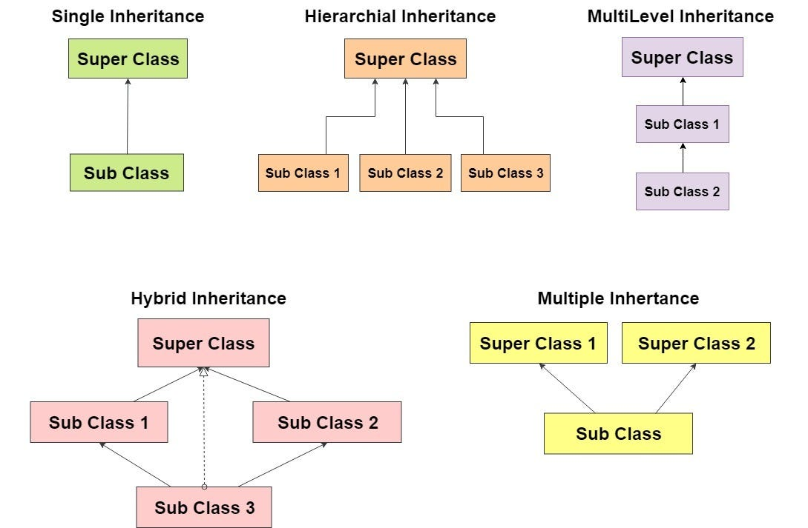

# Unit 4: Inheritance and Polymorphism

## Table of Contents

1. [Inheritance Basics](#41-inheritance-basics)
2. [Types of Inheritance](#42-inheritance-type-single-level-multi-level-multiple-and-hierarchical)
3. [`super` Keyword](#43-super-keyword)
4. [Polymorphism: Overloading and Overriding](#44-polymorphism-method-overloading-and-method-overriding)
5. [Object Class](#45-object-class)
6. [`final` Keyword](#46-final-keyword)
7. [Abstract Class and Methods](#47-abstract-class-and-methods)
8. [Access Control](#48-access-control-private-protected-default-and-public)
9. [Interface](#49-interface-defining-implementing-and-applying-interface)

---

## 4.1 Inheritance Basics

**Definition:** Inheritance is an OOP mechanism where a new class (**subclass/child class**) acquires the fields and methods of an existing class (**superclass/parent class**), promoting **code reusability**. Achieved in Java using the `extends` keyword.

### Example (Vehicle Registration)

```java
class Vehicle {                    // Parent/Super class
    String owner;

    void display() {
        System.out.println("Owner: " + owner);
    }
}

class Motorbike extends Vehicle {  // Child/Sub class
    String bikeModel;

    void showModel() {
        System.out.println("Bike Model: " + bikeModel);
    }
}

public class InheritanceDemo {
    public static void main(String[] args) {
        Motorbike m = new Motorbike();
        m.owner = "Alpha alpha";      // inherited from Vehicle
        m.bikeModel = "CBR 1000RR";
        m.display();     // inherited method
        m.showModel();
    }
}
```

### Key Terms

| Term                               | Meaning                                                                     |
| ---------------------------------- | --------------------------------------------------------------------------- |
| **Superclass (Base/Parent class)** | The class whose properties are inherited                                    |
| **Subclass (Derived/Child class)** | The class that inherits properties                                          |
| `extends`                          | Keyword used for class inheritance                                          |
| **IS-A relationship**              | Inheritance represents an "is-a" relationship, e.g., Motorbike IS-A Vehicle |

---

## 4.2 Inheritance Type (Single-level, Multi-level, Multiple and Hierarchical)



| Type                     | Description                                                                                                                                                                        |
| ------------------------ | ---------------------------------------------------------------------------------------------------------------------------------------------------------------------------------- |
| **Single-level**         | One class inherits from exactly one parent class                                                                                                                                   |
| **Multi-level**          | A class inherits from a class, which itself inherits from another class (chain)                                                                                                    |
| **Hierarchical**         | Multiple classes inherit from a single parent class                                                                                                                                |
| **Multiple Inheritance** | A class inherits from more than one parent — **Java does NOT support this with classes** (to avoid ambiguity, e.g., "Diamond Problem"), but it **is supported through interfaces** |

### Example: Multi-level Inheritance

```java
class Person {
    String name;
}
class Student extends Person {
    String faculty;
}
class BCAStudent extends Student {    // multi-level: BCAStudent -> Student -> Person
    int semester;

    void display() {
        System.out.println(name + " | " + faculty + " | Semester " + semester);
    }
}
```

### Example: Hierarchical Inheritance

```java
class Account {
  void showType() {
    System.out.println("Bank Account");
  }
}
class SavingsAccount extends Account { }

class CurrentAccount extends Account { }
// Both SavingsAccount and CurrentAccount inherit from Account
```

### Why Java Doesn't Support Multiple Inheritance (with classes)

If Class B and Class C both have a method `show()` and Class D inherits from both, the compiler cannot decide which `show()` to call — this is called the **"Diamond Problem"**. Java avoids this ambiguity by allowing multiple inheritance only through **interfaces** (which, prior to Java 8, had no method bodies).

---

## 4.3 'super' Keyword

**Definition:** `super` is a reference variable used to refer to the **immediate parent class** object. It is used to:

1. Access parent class's instance variables (if hidden by child).
2. Call parent class's methods (if overridden by child).
3. Call the parent class's constructor — `super(...)`.

### Example

```java
class Animal {
    String sound = "Some generic sound";

    Animal() {
        System.out.println("Animal constructor called");
    }

    void makeSound() {
        System.out.println("Animal makes: " + sound);
    }
}

class Dog extends Animal {
    String sound = "Bark";
    
    Dog() {
        super();               // calls Animal's constructor - must be the first line
        System.out.println("Dog constructor called");
    }
    void makeSound() {
        super.makeSound();     // calls Animal's makeSound()
        System.out.println("Dog makes: " + sound);
        System.out.println("Parent's sound was: " + super.sound);  // accessing parent's field
    }
}

public class SuperDemo {
    public static void main(String[] args) {
        Dog d = new Dog();
        d.makeSound();
    }
}
```

---

## 4.4 Polymorphism: Method Overloading and Method Overriding

**Definition of Polymorphism:** "Poly" (many) + "morph" (forms) — the ability of an object/method to take multiple forms, allowing the same interface to represent different underlying behaviors.

```
                 Polymorphism
                       │
       ┌───────────────┴───────────────┐
  Compile-Time (Static)          Run-Time (Dynamic)
   = Method Overloading            = Method Overriding
```

### 4.4.1 Method Overloading (Compile-Time Polymorphism)

Defining **multiple methods with the same name** but different **parameter list** (number/type of parameters) within the **same class**.

```java
public class Calculator {
    int add(int a, int b) {                 // version 1
        return a + b;
    }
    double add(double a, double b) {        // version 2 - different parameter type
        return a + b;
    }
    int add(int a, int b, int c) {          // version 3 - different number of parameters
        return a + b + c;
    }

    public static void main(String[] args) {
        Calculator c = new Calculator();
        System.out.println(c.add(5, 10));         // calls version 1
        System.out.println(c.add(2.5, 3.5));      // calls version 2
        System.out.println(c.add(1, 2, 3));       // calls version 3
    }
}
```

### 4.4.2 Method Overriding (Run-Time Polymorphism)

When a **subclass provides its own specific implementation** of a method that is already defined in its **superclass** — same name, same parameters, resolved at **run time**.

```java
class Animal{
  void makeSound(){
    System.out.println("Animal make sound!!");
  };
}

class Dog extends Animal{
  @Override
  void makeSound(){
    System.out.println("Dog Barks");
  }
}

class Cat extends Animal {
  @Override
  void makeSound(){
    System.out.println("Cat Meows");
  }
}
public class MethodOverriding {
  public static void main(String[] args) {
    Animal animal = new Animal();
    animal.makeSound();

    Dog dog = new Dog();
    dog.makeSound();
  }
}
```

### Difference: Overloading vs Overriding

| Basis                  | Method Overloading              | Method Overriding                |
| ---------------------- | ------------------------------- | -------------------------------- |
| Occurs in              | Same class                      | Parent-child (inherited) classes |
| Parameters             | Must differ (number/type/order) | Must be exactly the same         |
| Polymorphism type      | Compile-time (Static)           | Run-time (Dynamic)               |
| Return type            | Can differ                      | Must be same or covariant        |
| Inheritance required   | No                              | Yes                              |
| `@Override` annotation | Not used                        | Recommended to use               |

---

## 4.5 Object Class

**Definition:** `Object` is the **root/superclass of all classes** in Java (either directly or indirectly). Every class implicitly extends `Object` if it doesn't explicitly extend another class.

### Important Methods of Object Class

| Method             | Purpose                                                         |
| ------------------ | --------------------------------------------------------------- |
| `toString()`       | Returns a String representation of the object                   |
| `equals(Object o)` | Compares two objects for equality (default compares references) |
| `hashCode()`       | Returns a unique integer hash code for the object               |
| `getClass()`       | Returns the runtime class of the object                         |
| `clone()`          | Creates and returns a copy of the object                        |

### Example

```java
class Student {
    String name;
    Student(String name) { this.name = name; }

    @Override
    public String toString() {                 // overriding Object's toString()
        return "Student: " + name;
    }
}

public class ObjectClassDemo {
    public static void main(String[] args) {
        Student s = new Student("Manisha KC");
        System.out.println(s);                  // automatically calls toString()
        System.out.println(s.getClass().getName());  // Student
    }
}
```

---

## 4.6 'final' Keyword

**Definition:** `final` is a keyword used to apply restrictions — it can be used with **variables, methods, and classes**.

| Usage            | Effect                                                     |
| ---------------- | ---------------------------------------------------------- |
| `final` variable | Value cannot be changed once assigned (becomes a constant) |
| `final` method   | Cannot be overridden by a subclass                         |
| `final` class    | Cannot be inherited/extended by any other class            |

### Example

```java
final class Constants {              // final class - cannot be extended
    static final double PI = 3.14159; // final variable - constant

    final void show() {              // final method - cannot be overridden
        System.out.println("PI value = " + PI);
    }
}

public class FinalDemo {
    public static void main(String[] args) {
        Constants c = new Constants();
        c.show();
        // Constants.PI = 3.0;   // ERROR - cannot change final variable
    }
}
```

---
## 4.7 Abstract Class and Methods
 
**Definition:** An **abstract class** is a class declared using the `abstract` keyword that **cannot be instantiated** (no objects can be created directly). It may contain both abstract methods (no body) and concrete methods (with body). An **abstract method** has only a declaration, no implementation, and must be implemented by the first concrete subclass.
 
### Example (Loan Types)
 
```java
abstract class Loan {
    String borrower;
 
    abstract double calculateInterest(double principal);  // abstract method - no body
 
    void showBorrower() {                                  // concrete method
        System.out.println("Borrower: " + borrower);
    }
}
 
class HomeLoan extends Loan {
    @Override
    double calculateInterest(double principal) {
        return principal * 0.09;   // 9% interest
    }
}
 
class EducationLoan extends Loan {
    @Override
    double calculateInterest(double principal) {
        return principal * 0.07;   // 7% interest
    }
}
 
public class AbstractDemo {
    public static void main(String[] args) {
        Loan loan1 = new HomeLoan();
        loan1.borrower = "Alpha alpha";
        System.out.println(loan1.calculateInterest(500000));
 
        Loan loan2 = new EducationLoan();
        loan2.borrower = "Beta beta";
        System.out.println(loan2.calculateInterest(300000));
 
        // Loan l = new Loan();   // ERROR - cannot instantiate abstract class
    }
}
```
 
### Rules
- If a class has at least one abstract method, the class **must** be declared abstract.
- An abstract class **can have constructors**, fields, and normal methods too.
- A subclass must override **all** abstract methods, or itself be declared abstract.
---
 
## 4.8 Access Control (Private, Protected, Default and Public)
 
**Definition:** Access modifiers control the **visibility/scope** of classes, methods, and variables.
 
### Access Modifier Table
 
| Modifier | Same Class | Same Package | Subclass (different package) | Different Package (non-subclass) |
|---|:---:|:---:|:---:|:---:|
| `private` | ✅ | ❌ | ❌ | ❌ |
| *default* (no modifier) | ✅ | ✅ | ❌ | ❌ |
| `protected` | ✅ | ✅ | ✅ | ❌ |
| `public` | ✅ | ✅ | ✅ | ✅ |
 
### Diagram
 
```
public      : accessible EVERYWHERE
   │
protected   : accessible within package + subclasses (even in other packages)
   │
default     : accessible only within the SAME package
   │
private     : accessible only within the SAME class
```
 
### Example
 
```java
public class Employee {
    private double salary;       // accessible only within this class
    protected String department; // accessible within package + subclasses
    String empId;                // default - accessible within same package
    public String name;          // accessible from anywhere
 
    private void showSalary() {
        System.out.println("Salary: " + salary);
    }
}
```
 
---
 
## 4.9 Interface: Defining, Implementing and Applying Interface
 
**Definition:** An interface is a **blueprint of a class** that contains only **abstract methods** (prior to Java 8), **static/default methods** (Java 8+), and **constants** (implicitly `public static final`). A class **implements** an interface using the `implements` keyword, providing bodies for all its abstract methods. Interfaces enable **full abstraction** and support **multiple inheritance** in Java.
 
### 4.9.1 Defining an Interface
 
```java
interface Payable {
    double TAX_RATE = 0.13;             // implicitly public static final (13% VAT - Nepal context)
    double calculateSalary();           // implicitly public abstract
}
```
 
### 4.9.2 Implementing an Interface
 
```java
class Employee implements Payable {
    double basicSalary;
    Employee(double basicSalary) { this.basicSalary = basicSalary; }
 
    @Override
    public double calculateSalary() {
        return basicSalary + (basicSalary * TAX_RATE);
    }
}
 
public class InterfaceDemo {
    public static void main(String[] args) {
        Employee e = new Employee(50000);
        System.out.println("Total Salary with tax: " + e.calculateSalary());
    }
}
```
 
### 4.9.3 Multiple Inheritance using Interface
 
```java
interface Printable {
    void print();
}
interface Showable {
    void show();
}
 
class Report implements Printable, Showable {   // implementing multiple interfaces
    public void print() { System.out.println("Printing report..."); }
    public void show() { System.out.println("Showing report..."); }
}
```
 
### Difference: Abstract Class vs Interface
 
| Basis | Abstract Class | Interface |
|---|---|---|
| Keyword | `abstract class` | `interface` |
| Methods | Can have abstract + concrete methods | Traditionally only abstract; Java 8+ allows `default`/`static` methods |
| Variables | Can have any type of variables | Only `public static final` (constants) |
| Inheritance | A class can extend only **one** abstract class | A class can implement **multiple** interfaces |
| Constructor | Can have constructors | Cannot have constructors |
| Access modifiers | Methods can be private/protected/public | Methods are implicitly public |
| Use case | When classes share a common base with some shared code | When unrelated classes need to guarantee certain behavior |
 
---


