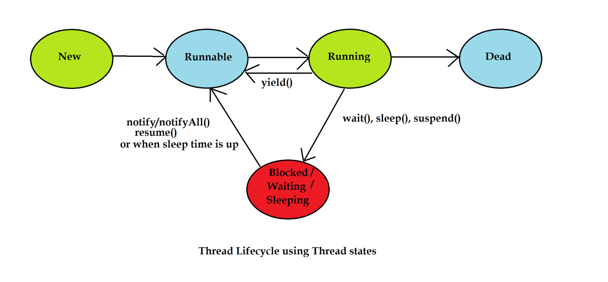

# Unit 5: Exception Handling and Multithreading

 
## Table of Contents
 
1. [Basic Exceptions, Proper Use of Exceptions](#51-basic-exceptions-proper-use-of-exceptions)
2. [Exception Hierarchy](#52-exception-hierarchy)
3. [Exception Handling Keywords: try, catch, throw, throws, finally](#53-exception-handling-keywords-try-catch-throw-throws-finally)
4. [Java's Built-in Exceptions](#54-javas-built-in-exceptions)
5. [User-defined Exceptions](#55-user-defined-exceptions)
6. [Multithreading Basics](#56-multithreading-basics)
7. [Thread Class and Runnable Interface](#57-thread-class-and-runnable-interface)
8. [Thread Priorities](#58-thread-priorities)
9. [Thread Synchronization and Inter-thread Communication](#59-thread-synchronization-and-inter-thread-communication)
---
 
## 5.1 Basic Exceptions, Proper Use of Exceptions
 
**Definition:** An **exception** is an unwanted or unexpected event that disrupts the normal flow of a program's instructions during execution. **Exception Handling** is a mechanism to detect and manage such runtime errors so that the normal flow of the program can be maintained without crashing.
 
### Why Use Exception Handling?
 
| Reason | Explanation |
| ------ | ----------- |
| **Program continuity** | Prevents abnormal termination of the program |
| **Separation of concerns** | Separates error-handling code from regular business logic |
| **Debugging** | Provides detailed information (stack trace) about what went wrong and where |
| **Robustness** | Allows a program to recover gracefully from unexpected situations |
 
### Example (Without Exception Handling)
 
```java
public class DivideDemo {
    public static void main(String[] args) {
        int a = 10, b = 0;
        System.out.println(a / b);   // throws ArithmeticException, program crashes here
        System.out.println("This line never executes");
    }
}
```
 
### Example (With Exception Handling)
 
```java
public class DivideDemoSafe {
    public static void main(String[] args) {
        int a = 10, b = 0;
        try {
            System.out.println(a / b);
        } catch (ArithmeticException e) {
            System.out.println("Cannot divide by zero: " + e.getMessage());
        }
        System.out.println("Program continues normally");
    }
}
```
 
### Proper Use of Exceptions — Best Practices
 
- Use exceptions only for **exceptional/unexpected** conditions, not for normal control flow (e.g., don't use exceptions instead of `if` checks for expected situations).
- Catch **specific exceptions** first, rather than catching a generic `Exception` everywhere.
- Never leave a `catch` block empty — at least log the error.
- Close resources properly (use `finally` or try-with-resources).
- Don't overuse exceptions for simple validation that a condition check can handle.
---
 
## 5.2 Exception Hierarchy
 
All exception and error classes in Java are subclasses of the `Throwable` class.
 
```
                         Object
                            │
                        Throwable
                       ┌────┴────┐
                   Exception    Error
                  ┌────┴─────┐        (e.g. OutOfMemoryError,
          Checked          RuntimeException   StackOverflowError)
        Exceptions            │
      (IOException,     ┌─────┴──────────────────┐
       SQLException) ArithmeticException   NullPointerException
                      ArrayIndexOutOfBoundsException
                      NumberFormatException  ClassCastException ...
```
 
### Key Classes
 
| Class | Description |
| ----- | ----------- |
| **Throwable** | Root class for all errors and exceptions |
| **Exception** | Represents conditions a program should catch and handle; recoverable |
| **Error** | Represents serious problems that a normal application should **not** try to catch (e.g., `OutOfMemoryError`, `StackOverflowError`) — usually caused by the environment/JVM |
| **RuntimeException** | Subclass of `Exception`; represents **unchecked** exceptions (programming errors) |
 
### Checked vs Unchecked Exceptions
 
| Basis | Checked Exception | Unchecked Exception |
| ----- | ------------------ | -------------------- |
| Checked at | Compile time | Runtime |
| Must be declared/handled | Yes (`throws` or `try-catch`) | No (optional) |
| Superclass | `Exception` (excluding `RuntimeException`) | `RuntimeException` |
| Examples | `IOException`, `SQLException`, `ClassNotFoundException` | `ArithmeticException`, `NullPointerException`, `ArrayIndexOutOfBoundsException` |
| Cause | External factors (file not found, DB down) | Programming logic mistakes |
 
---
 
## 5.3 Exception Handling Keywords: try, catch, throw, throws, finally
 
| Keyword | Purpose |
| ------- | ------- |
| `try` | Block of code that might throw an exception |
| `catch` | Block that handles the exception thrown by the `try` block |
| `throw` | Used to explicitly throw an exception (an instance) from a method or block |
| `throws` | Used in a method signature to declare that the method might throw certain exceptions |
| `finally` | Block that always executes, whether an exception occurs or not (used for cleanup) |
 
### Example (try, multiple catch, finally)
 
```java
public class MultiCatchDemo {
    public static void main(String[] args) {
        int[] marks = {80, 90, 75};
        try {
            System.out.println(marks[5]);          // ArrayIndexOutOfBoundsException
            int result = 10 / 0;                    // never reached
        } catch (ArrayIndexOutOfBoundsException e) {
            System.out.println("Array error: " + e.getMessage());
        } catch (ArithmeticException e) {
            System.out.println("Arithmetic error: " + e.getMessage());
        } finally {
            System.out.println("Finally block always executes - cleanup done");
        }
    }
}
```
 
### Example (throw and throws)
 
```java
public class AgeValidator {
    // 'throws' declares that this method might throw a checked/unchecked exception
    static void validateAge(int age) throws IllegalArgumentException {
        if (age < 18) {
            throw new IllegalArgumentException("Age must be 18 or above");  // 'throw' - explicitly throws
        }
        System.out.println("Age is valid: " + age);
    }
 
    public static void main(String[] args) {
        try {
            validateAge(15);
        } catch (IllegalArgumentException e) {
            System.out.println("Validation failed: " + e.getMessage());
        }
    }
}
```
 
### Order of Execution
 
- `catch` blocks must be ordered from **most specific to most general** (a subclass exception before its superclass), otherwise a compile error occurs.
- `finally` executes even if a `return` statement is present in the `try` or `catch` block (unless `System.exit()` is called).
---
 
## 5.4 Java's Built-in Exceptions
 
Java provides many predefined exception classes in `java.lang` and other packages.
 
### Common Unchecked (Runtime) Exceptions
 
| Exception | Cause |
| --------- | ----- |
| `ArithmeticException` | Invalid arithmetic operation, e.g., division by zero |
| `NullPointerException` | Accessing a method/field on a `null` reference |
| `ArrayIndexOutOfBoundsException` | Accessing an array index outside its valid range |
| `NumberFormatException` | Invalid conversion of a String to a number, e.g., `Integer.parseInt("abc")` |
| `ClassCastException` | Invalid typecasting between incompatible classes |
| `IllegalArgumentException` | A method receives an argument that is inappropriate |
| `NegativeArraySizeException` | Creating an array with a negative size |
 
### Common Checked Exceptions
 
| Exception | Cause |
| --------- | ----- |
| `IOException` | Input/output operation failure (file, stream) |
| `FileNotFoundException` | Attempting to access a file that doesn't exist |
| `ClassNotFoundException` | Class not found while loading dynamically (e.g., `Class.forName`) |
| `InterruptedException` | A thread is interrupted while waiting/sleeping |
| `SQLException` | Database access error |
 
### Example
 
```java
public class BuiltInExceptionsDemo {
    public static void main(String[] args) {
        try {
            String s = null;
            System.out.println(s.length());        // NullPointerException
        } catch (NullPointerException e) {
            System.out.println("Null reference: " + e);
        }
 
        try {
            int num = Integer.parseInt("abc");      // NumberFormatException
        } catch (NumberFormatException e) {
            System.out.println("Invalid number format: " + e);
        }
 
        try {
            Object obj = "hello";
            Integer i = (Integer) obj;               // ClassCastException
        } catch (ClassCastException e) {
            System.out.println("Cast error: " + e);
        }
    }
}
```
 
---
 
## 5.5 User-defined Exceptions
 
**Definition:** Custom/user-defined exceptions are created by extending the `Exception` class (checked) or `RuntimeException` class (unchecked) when built-in exceptions don't precisely describe a specific problem domain.
 
### Example (Bank Withdrawal)
 
```java
// Custom checked exception
class InsufficientBalanceException extends Exception {
    InsufficientBalanceException(String message) {
        super(message);            // passes message to Exception's constructor
    }
}
 
class BankAccount {
    double balance;
    BankAccount(double balance) { this.balance = balance; }
 
    void withdraw(double amount) throws InsufficientBalanceException {
        if (amount > balance) {
            throw new InsufficientBalanceException("Insufficient balance for withdrawal of Rs. " + amount);
        }
        balance -= amount;
        System.out.println("Withdrawal successful. Remaining balance: " + balance);
    }
}
 
public class UserDefinedExceptionDemo {
    public static void main(String[] args) {
        BankAccount account = new BankAccount(5000);
        try {
            account.withdraw(8000);
        } catch (InsufficientBalanceException e) {
            System.out.println("Transaction failed: " + e.getMessage());
        }
    }
}
```
 
### Steps to Create a User-defined Exception
 
1. Create a class that extends `Exception` (checked) or `RuntimeException` (unchecked).
2. Provide a constructor that calls `super(message)` to set the error message.
3. `throw` an instance of the custom exception where the invalid condition is detected.
4. Declare the method with `throws` (if checked) and handle it using `try-catch` at the calling site.
---
 
## 5.6 Multithreading Basics
 
**Definition:** A **thread** is the smallest unit of execution within a process. **Multithreading** is the ability of a program to execute multiple threads concurrently, allowing multiple tasks to run seemingly at the same time, sharing the same memory space.
 
### Process vs Thread
 
| Basis | Process | Thread |
| ----- | ------- | ------ |
| Definition | An independent running program with its own memory | A lightweight sub-unit of a process |
| Memory | Separate memory space | Shares memory with other threads of the same process |
| Communication | Costly (inter-process communication) | Easy and fast (shared memory) |
| Creation overhead | High | Low |
 
### Life Cycle of a Thread


 
```
   New → Runnable → Running → Blocked/Waiting → Terminated
                        ↑___________|
                     (returns when resource available)
```
 
| State | Description |
| ----- | ----------- |
| **New** | Thread object created but `start()` not yet called |
| **Runnable** | Thread is ready to run and waiting for CPU allocation |
| **Running** | Thread is currently executing |
| **Blocked/Waiting** | Thread is temporarily inactive (waiting for a resource or another thread) |
| **Terminated (Dead)** | Thread has completed execution or was stopped |
 
### Why Use Multithreading?
 
- Better CPU utilization (idle time reduced)
- Improves application responsiveness (e.g., UI stays responsive while background work runs)
- Enables parallel execution of independent tasks
---
 
## 5.7 Thread Class and Runnable Interface
 
Java provides two ways to create a thread:
 
### Method 1: Extending the `Thread` class
 
```java
class MyThread extends Thread {
    public void run() {                       // override run() - contains thread's task
        for (int i = 1; i <= 5; i++) {
            System.out.println(Thread.currentThread().getName() + " - Count: " + i);
        }
    }
}
 
public class ThreadClassDemo {
    public static void main(String[] args) {
        MyThread t1 = new MyThread();
        MyThread t2 = new MyThread();
        t1.start();          // start() creates a new call stack and invokes run()
        t2.start();
    }
}
```
 
### Method 2: Implementing the `Runnable` Interface
 
```java
class MyRunnable implements Runnable {
    public void run() {
        for (int i = 1; i <= 5; i++) {
            System.out.println(Thread.currentThread().getName() + " - Value: " + i);
        }
    }
}
 
public class RunnableDemo {
    public static void main(String[] args) {
        MyRunnable task = new MyRunnable();
        Thread t1 = new Thread(task, "Worker-1");
        Thread t2 = new Thread(task, "Worker-2");
        t1.start();
        t2.start();
    }
}
```
 
### `Thread` class vs `Runnable` interface
 
| Basis | Extending `Thread` | Implementing `Runnable` |
| ----- | ------------------- | ------------------------ |
| Inheritance | Uses up the single inheritance slot | Class can still extend another class |
| Flexibility | Less flexible | More flexible (recommended approach) |
| Object relationship | The object itself is a thread | The task object is separate from the thread |
 
### Important Thread Methods
 
| Method | Purpose |
| ------ | ------- |
| `start()` | Begins execution of the thread; invokes `run()` in a new call stack |
| `run()` | Contains the code executed by the thread |
| `sleep(ms)` | Pauses the thread for the given milliseconds |
| `join()` | Waits for a thread to finish execution before continuing |
| `isAlive()` | Checks whether a thread is still running |
| `getName()` / `setName()` | Gets/sets the thread's name |
 
---
 
## 5.8 Thread Priorities
 
**Definition:** Every thread has a **priority** (an integer value) that helps the thread scheduler decide the order in which threads are given CPU time. Higher priority threads generally get preference, although this is not guaranteed and depends on the JVM/OS scheduler.
 
### Priority Constants (defined in `Thread` class)
 
| Constant | Value |
| -------- | ----- |
| `Thread.MIN_PRIORITY` | 1 |
| `Thread.NORM_PRIORITY` | 5 (default priority) |
| `Thread.MAX_PRIORITY` | 10 |
 
### Example
 
```java
class PriorityTask extends Thread {
    public void run() {
        System.out.println(Thread.currentThread().getName() + " running with priority " 
                            + Thread.currentThread().getPriority());
    }
}
 
public class ThreadPriorityDemo {
    public static void main(String[] args) {
        PriorityTask t1 = new PriorityTask();
        PriorityTask t2 = new PriorityTask();
 
        t1.setName("Low-Priority-Thread");
        t2.setName("High-Priority-Thread");
 
        t1.setPriority(Thread.MIN_PRIORITY);   // priority = 1
        t2.setPriority(Thread.MAX_PRIORITY);   // priority = 10
 
        t1.start();
        t2.start();
    }
}
```
 
**Note:** Thread priority is only a **hint** to the scheduler, not a guarantee — actual execution order can vary across different JVM implementations and operating systems.
 
---
 
## 5.9 Thread Synchronization and Inter-thread Communication
 
### Why Synchronization?
 
When multiple threads access a **shared resource** (like a variable or object) concurrently, it can lead to a **race condition**, producing inconsistent or incorrect results. **Synchronization** ensures only one thread accesses the critical section at a time.
 
### Example (Without Synchronization — Problem)
 
```java
class Counter {
    int count = 0;
    void increment() {
        count++;      // not atomic - can cause race condition
    }
}
```
 
### Example (With `synchronized` Keyword)
 
```java
class Counter {
    int count = 0;
 
    synchronized void increment() {     // only one thread can execute this at a time
        count++;
    }
}
 
class IncrementThread extends Thread {
    Counter counter;
    IncrementThread(Counter counter) { this.counter = counter; }
 
    public void run() {
        for (int i = 0; i < 1000; i++) {
            counter.increment();
        }
    }
}
 
public class SynchronizationDemo {
    public static void main(String[] args) throws InterruptedException {
        Counter counter = new Counter();
        IncrementThread t1 = new IncrementThread(counter);
        IncrementThread t2 = new IncrementThread(counter);
 
        t1.start();
        t2.start();
        t1.join();     // wait for t1 to finish
        t2.join();     // wait for t2 to finish
 
        System.out.println("Final Count: " + counter.count);  // always 2000
    }
}
```
 
### Types of Synchronization
 
| Type | Description |
| ---- | ----------- |
| **Synchronized method** | Entire method is locked; only one thread can execute it on the same object at a time |
| **Synchronized block** | Only a specific critical section of code is locked, allowing finer control |
 
```java
void deposit(double amount) {
    synchronized (this) {          // synchronized block on 'this' object
        balance += amount;
    }
}
```
 
### Inter-thread Communication (`wait()`, `notify()`, `notifyAll()`)
 
Used when cooperating threads need to communicate about the state of a shared resource (e.g., Producer-Consumer problem). These methods must be called from within a `synchronized` context.
 
| Method | Purpose |
| ------ | ------- |
| `wait()` | Causes the current thread to release the lock and wait until notified |
| `notify()` | Wakes up a single waiting thread |
| `notifyAll()` | Wakes up all threads waiting on the object's monitor |
 
### Example (Simplified Producer-Consumer)
 
```java
class SharedBuffer {
    private int data;
    private boolean available = false;
 
    synchronized void produce(int value) throws InterruptedException {
        while (available) {
            wait();                       // wait until consumer consumes
        }
        data = value;
        available = true;
        System.out.println("Produced: " + value);
        notify();                          // notify the consumer
    }
 
    synchronized void consume() throws InterruptedException {
        while (!available) {
            wait();                       // wait until producer produces
        }
        System.out.println("Consumed: " + data);
        available = false;
        notify();                          // notify the producer
    }
}
```
 
---
