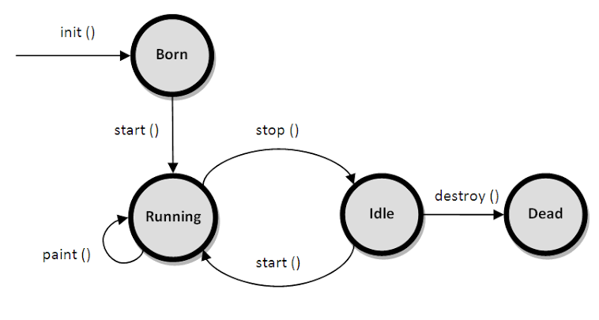

# Unit 4: Event Handling, Applet and Swing

## Table of Contents

1. [Event and GUI Programming](#41-event-and-gui-programming)
   - 4.1.1 [Event Handling in Java](#411-event-handling-in-java)
   - 4.1.2 [Event Types](#412-event-types-mouse-and-key-events)
   - 4.1.4 [GUI Basics](#414-gui-basics)
   - 4.1.5 [Panels](#415-panels)
   - 4.1.6 [Frames](#416-frames)
2. [Layout Managers](#42-layout-managers)
   - 4.2.1 [Flow Layout](#421-flow-layout)
   - 4.2.2 [Border Layout](#422-border-layout)
   - 4.2.3 [Grid Layout](#423-grid-layout)
3. [GUI Components](#43-gui-components)
4. [Applet](#44-applet)
5. [Introduction to Swing](#45-introduction-to-swing)

---

## 4.1 Event and GUI Programming

**Definition:** **GUI (Graphical User Interface) programming** allows a user to interact with a program through visual components (buttons, text fields, menus) rather than only through the console. In Java, GUI programming is primarily done using the **AWT (Abstract Window Toolkit)** and **Swing** toolkits, part of the `java.awt` and `javax.swing` packages respectively.

### 4.1.1 Event Handling in Java

**Definition:** An **event** is an object that describes a change of state in a source (e.g., a button being clicked, a key being pressed, the mouse moving). **Event handling** is the mechanism that controls an event and decides what should happen if it occurs. Java uses the **Delegation Event Model** for this.

### The Delegation Event Model

```
   Event Source                Event Object              Event Listener
  (e.g., Button)   ───fires───►  (ActionEvent)  ───sent to───►  (ActionListener)
                                                                       │
                                                              handles the event
                                                              inside a callback
                                                              method
```

| Term | Meaning |
| ---- | ------- |
| **Event Source** | The component that generates (fires) an event, e.g., a `Button`, `TextField` |
| **Event Object** | Encapsulates information about the event, e.g., `ActionEvent`, `MouseEvent` |
| **Event Listener** | An interface that receives and processes events; must be **registered** with the source |

### Steps to Handle an Event

1. Implement the appropriate **Listener interface** (e.g., `ActionListener`).
2. Override the interface's callback method (e.g., `actionPerformed()`).
3. **Register** the listener with the event source using an `addXxxListener()` method.

### Example: Basic Button Click Event

```java
import java.awt.*;
import java.awt.event.*;

public class ButtonClickDemo extends Frame implements ActionListener {
    Button clickButton;
    Label statusLabel;

    ButtonClickDemo() {
        clickButton = new Button("Click Me");
        statusLabel = new Label("Waiting for click...");

        clickButton.addActionListener(this);   // register listener - step 3

        setLayout(new FlowLayout());
        add(clickButton);
        add(statusLabel);

        setSize(300, 150);
        setTitle("Button Click Demo");
        setVisible(true);
    }

    // callback method - step 2 (from ActionListener interface - step 1)
    public void actionPerformed(ActionEvent e) {
        statusLabel.setText("Button was clicked!");
    }

    public static void main(String[] args) {
        new ButtonClickDemo();
    }
}
```

### 4.1.2 Event Types (Mouse and Key Events)

### Common Event Classes and Listener Interfaces

| Event Class | Listener Interface | Triggered When |
| ----------- | ------------------- | --------------- |
| `ActionEvent` | `ActionListener` | A button is clicked, menu item selected, Enter pressed in a text field |
| `MouseEvent` | `MouseListener` / `MouseMotionListener` | Mouse clicked, pressed, released, entered, exited, dragged, moved |
| `KeyEvent` | `KeyListener` | A key is pressed, released, or typed |
| `ItemEvent` | `ItemListener` | State of a checkbox/choice/list item changes |
| `WindowEvent` | `WindowListener` | Window opened, closed, minimized, activated |
| `AdjustmentEvent` | `AdjustmentListener` | Scrollbar value is adjusted |

### `MouseListener` and `MouseMotionListener` Methods

| Method | Fired When |
| ------ | ----------- |
| `mouseClicked(MouseEvent e)` | Mouse button clicked (pressed + released) |
| `mousePressed(MouseEvent e)` | Mouse button pressed down |
| `mouseReleased(MouseEvent e)` | Mouse button released |
| `mouseEntered(MouseEvent e)` | Mouse pointer enters a component |
| `mouseExited(MouseEvent e)` | Mouse pointer leaves a component |
| `mouseDragged(MouseEvent e)` | Mouse dragged while a button is pressed (`MouseMotionListener`) |
| `mouseMoved(MouseEvent e)` | Mouse moved without a button pressed (`MouseMotionListener`) |

### Example: Mouse Event Handling

```java
import java.awt.*;
import java.awt.event.*;

public class MouseEventDemo extends Frame implements MouseListener {
    Label statusLabel;

    MouseEventDemo() {
        statusLabel = new Label("Move your mouse over the window");
        add(statusLabel);
        addMouseListener(this);        // register this Frame as a mouse listener

        setSize(350, 200);
        setLayout(new FlowLayout());
        setVisible(true);
    }

    public void mouseClicked(MouseEvent e) {
        statusLabel.setText("Mouse clicked at (" + e.getX() + ", " + e.getY() + ")");
    }
    public void mousePressed(MouseEvent e)  { statusLabel.setText("Mouse pressed"); }
    public void mouseReleased(MouseEvent e) { statusLabel.setText("Mouse released"); }
    public void mouseEntered(MouseEvent e)  { statusLabel.setText("Mouse entered window"); }
    public void mouseExited(MouseEvent e)   { statusLabel.setText("Mouse exited window"); }

    public static void main(String[] args) {
        new MouseEventDemo();
    }
}
```

### `KeyListener` Methods

| Method | Fired When |
| ------ | ----------- |
| `keyPressed(KeyEvent e)` | A key is pressed down |
| `keyReleased(KeyEvent e)` | A key is released |
| `keyTyped(KeyEvent e)` | A character key is typed (pressed + released, character-producing keys only) |

### Example: Key Event Handling

```java
import java.awt.*;
import java.awt.event.*;

public class KeyEventDemo extends Frame implements KeyListener {
    TextField inputField;
    Label statusLabel;

    KeyEventDemo() {
        inputField = new TextField(20);
        statusLabel = new Label("Type something...");

        inputField.addKeyListener(this);

        setLayout(new FlowLayout());
        add(inputField);
        add(statusLabel);
        setSize(300, 150);
        setVisible(true);
    }

    public void keyPressed(KeyEvent e) {
        statusLabel.setText("Key pressed: " + KeyEvent.getKeyText(e.getKeyCode()));
    }
    public void keyReleased(KeyEvent e) { statusLabel.setText("Key released"); }
    public void keyTyped(KeyEvent e)    { /* character typed */ }

    public static void main(String[] args) {
        new KeyEventDemo();
    }
}
```

### 4.1.4 GUI Basics

Java's GUI programming relies on a **component hierarchy**: every visible element (button, panel, frame) is a `Component`. A `Container` is a special component that can hold other components.

```
                     Component
                         │
                     Container
              ┌──────────┼──────────┐
            Panel        Window    (other containers)
                            │
                          Frame, Dialog
```

| Term | Meaning |
| ---- | ------- |
| **Component** | Any visible GUI object (button, label, checkbox, etc.) — the basic building block |
| **Container** | A component that can hold and organize other components (`Panel`, `Frame`) |
| **Window** | A top-level container with no borders/menu bar (rarely used directly) |

### 4.1.5 Panels

**Definition:** `Panel` (AWT) / `JPanel` (Swing) is a **container** used to group and organize related components; it has no title bar and cannot exist independently — it must be placed inside another container like a `Frame`.

```java
import java.awt.*;

public class PanelDemo extends Frame {
    PanelDemo() {
        Panel panel = new Panel();          // panel to group components
        panel.setBackground(Color.LIGHT_GRAY);
        panel.add(new Button("OK"));
        panel.add(new Button("Cancel"));

        add(panel);                          // add the panel to the frame
        setSize(300, 150);
        setTitle("Panel Demo");
        setVisible(true);
    }

    public static void main(String[] args) {
        new PanelDemo();
    }
}
```

### 4.1.6 Frames

**Definition:** `Frame` (AWT) / `JFrame` (Swing) is a **top-level window** with a title bar, borders, and (optionally) a menu bar. It is the main container in which other GUI components are placed to build a desktop application window.

```java
import java.awt.*;
import java.awt.event.*;

public class FrameDemo extends Frame {
    FrameDemo() {
        setTitle("My First Frame");
        setSize(400, 300);                 // width x height in pixels
        setLayout(new FlowLayout());

        add(new Label("This is a Frame example"));

        // Frames do not close automatically - must handle the close event
        addWindowListener(new WindowAdapter() {
            public void windowClosing(WindowEvent e) {
                System.exit(0);            // terminate the program on close
            }
        });

        setVisible(true);
    }

    public static void main(String[] args) {
        new FrameDemo();
    }
}
```

---

## 4.2 Layout Managers

**Definition:** A **layout manager** automatically arranges components within a container, controlling their size and position, so the developer doesn't need to manually set pixel coordinates. Every container has a default layout manager, which can be changed using `setLayout()`.

### 4.2.1 Flow Layout

**Definition:** Arranges components **left to right**, in the order they were added, wrapping to a new line when the row is full. This is the **default layout for `Panel`**.

```java
import java.awt.*;

public class FlowLayoutDemo extends Frame {
    FlowLayoutDemo() {
        setLayout(new FlowLayout(FlowLayout.CENTER, 10, 10));  // alignment, hgap, vgap
        add(new Button("One"));
        add(new Button("Two"));
        add(new Button("Three"));
        add(new Button("Four"));

        setSize(300, 150);
        setTitle("FlowLayout Demo");
        setVisible(true);
    }

    public static void main(String[] args) {
        new FlowLayoutDemo();
    }
}
```

### 4.2.2 Border Layout

**Definition:** Divides the container into **five regions**: `NORTH`, `SOUTH`, `EAST`, `WEST`, and `CENTER`. Each region holds at most one component, and the `CENTER` region expands to fill remaining space. This is the **default layout for `Frame`**.

```
   ┌─────────────── NORTH ───────────────┐
   │                                       │
 WEST              CENTER               EAST
   │                                       │
   └─────────────── SOUTH ───────────────┘
```

```java
import java.awt.*;

public class BorderLayoutDemo extends Frame {
    BorderLayoutDemo() {
        setLayout(new BorderLayout());
        add(new Button("North"), BorderLayout.NORTH);
        add(new Button("South"), BorderLayout.SOUTH);
        add(new Button("East"), BorderLayout.EAST);
        add(new Button("West"), BorderLayout.WEST);
        add(new Button("Center"), BorderLayout.CENTER);

        setSize(300, 200);
        setTitle("BorderLayout Demo");
        setVisible(true);
    }

    public static void main(String[] args) {
        new BorderLayoutDemo();
    }
}
```

### 4.2.3 Grid Layout

**Definition:** Arranges components in a **rectangular grid** of equal-sized rows and columns; components are added left to right, top to bottom.

```java
import java.awt.*;

public class GridLayoutDemo extends Frame {
    GridLayoutDemo() {
        setLayout(new GridLayout(3, 2, 5, 5));   // 3 rows, 2 columns, hgap, vgap

        for (int i = 1; i <= 6; i++) {
            add(new Button("Button " + i));
        }

        setSize(300, 200);
        setTitle("GridLayout Demo");
        setVisible(true);
    }

    public static void main(String[] args) {
        new GridLayoutDemo();
    }
}
```

### Layout Manager Comparison

| Layout | Arrangement | Default For |
| ------ | ----------- | ------------ |
| `FlowLayout` | Left to right, wraps to next line | `Panel`, `Applet` |
| `BorderLayout` | 5 fixed regions (N, S, E, W, Center) | `Frame`, `Window`, `Dialog` |
| `GridLayout` | Equal-sized rows x columns grid | None (must be set explicitly) |

---

## 4.3 GUI Components

Java's AWT/Swing provide many ready-made components for building interactive interfaces. The examples below use **Swing** (`javax.swing`) components (prefixed with `J`), which are more feature-rich than their AWT counterparts and are the recommended choice.

### 4.3.1 Buttons (`JButton`)

A clickable component that triggers an `ActionEvent` when pressed.

```java
JButton submitButton = new JButton("Submit");
submitButton.addActionListener(e -> System.out.println("Submitted!"));
```

### 4.3.2 Check Boxes (`JCheckBox`)

Allows the user to select **one or more** independent options (on/off state).

```java
JCheckBox nepal = new JCheckBox("Nepal");
JCheckBox india = new JCheckBox("India");
nepal.addItemListener(e -> System.out.println("Nepal selected: " + nepal.isSelected()));
```

### 4.3.3 Radio Buttons (`JRadioButton`)

Allows the user to select **only one** option among a group; grouped together using a `ButtonGroup` so selecting one deselects the others.

```java
JRadioButton male = new JRadioButton("Male");
JRadioButton female = new JRadioButton("Female");

ButtonGroup genderGroup = new ButtonGroup();   // ensures mutual exclusivity
genderGroup.add(male);
genderGroup.add(female);
```

### 4.3.4 Labels (`JLabel`)

Displays a short, non-editable text or image string; used to describe/identify other components.

```java
JLabel nameLabel = new JLabel("Enter your name:");
```

### 4.3.5 Text Fields (`JTextField`)

A single-line editable text input.

```java
JTextField nameField = new JTextField(20);   // 20 = visible column width
String enteredText = nameField.getText();
```

### 4.3.6 Text Area (`JTextArea`)

A multi-line editable text input; often wrapped in a `JScrollPane` for scrolling.

```java
JTextArea messageArea = new JTextArea(5, 20);   // rows, columns
JScrollPane scrollPane = new JScrollPane(messageArea);
```

### 4.3.7 Combo Boxes (`JComboBox`)

A dropdown list allowing the user to select **one item** from a list, saving screen space.

```java
String[] cities = {"Kathmandu", "Butwal", "Pokhara", "Biratnagar"};
JComboBox<String> cityBox = new JComboBox<>(cities);
```

### 4.3.8 Lists (`JList`)

Displays a set of items, from which the user can select **one or more**.

```java
String[] fruits = {"Apple", "Mango", "Banana"};
JList<String> fruitList = new JList<>(fruits);
fruitList.setSelectionMode(ListSelectionModel.MULTIPLE_INTERVAL_SELECTION);
```

### 4.3.9 Scroll Bars (`JScrollBar`)

Allows scrolling through content that doesn't fit in the visible area; can be horizontal or vertical.

```java
JScrollBar verticalBar = new JScrollBar(JScrollBar.VERTICAL, 0, 10, 0, 100);
// (orientation, initial value, extent, min, max)
```

### 4.3.10 Sliders (`JSlider`)

Lets the user select a numeric value by sliding a knob within a range.

```java
JSlider volumeSlider = new JSlider(JSlider.HORIZONTAL, 0, 100, 50);  // min, max, initial
volumeSlider.setMajorTickSpacing(20);
volumeSlider.setPaintTicks(true);
volumeSlider.setPaintLabels(true);
```

### 4.3.11 Windows (`JWindow`)

A top-level container **without** a title bar, border, or menu bar; used for splash screens or custom pop-ups.

```java
JWindow splashWindow = new JWindow();
splashWindow.add(new JLabel("Loading..."));
splashWindow.setSize(200, 100);
splashWindow.setVisible(true);
```

### 4.3.12 Menus (`JMenuBar`, `JMenu`, `JMenuItem`)

Provides a structured way to organize commands under a menu bar, typically at the top of a `JFrame`.

```java
JMenuBar menuBar = new JMenuBar();
JMenu fileMenu = new JMenu("File");
JMenuItem openItem = new JMenuItem("Open");
JMenuItem exitItem = new JMenuItem("Exit");

fileMenu.add(openItem);
fileMenu.add(exitItem);
menuBar.add(fileMenu);
// frame.setJMenuBar(menuBar);
```

### 4.3.13 Dialog Boxes (`JDialog`, `JOptionPane`)

A pop-up window used to interact briefly with the user — e.g., confirmations, warnings, or simple input requests. `JOptionPane` provides ready-made standard dialogs.

```java
// simple message dialog
JOptionPane.showMessageDialog(null, "Operation completed successfully!");

// confirmation dialog
int choice = JOptionPane.showConfirmDialog(null, "Do you want to save changes?");

// input dialog
String userInput = JOptionPane.showInputDialog("Enter your name:");
```

### Complete Example: Registration Form (Combining Components)

```java
import javax.swing.*;
import java.awt.*;

public class RegistrationForm extends JFrame {
    RegistrationForm() {
        setTitle("Registration Form");
        setLayout(new GridLayout(5, 2, 10, 10));

        add(new JLabel("Name:"));
        add(new JTextField(15));

        add(new JLabel("Gender:"));
        JPanel genderPanel = new JPanel();
        JRadioButton male = new JRadioButton("Male");
        JRadioButton female = new JRadioButton("Female");
        ButtonGroup genderGroup = new ButtonGroup();
        genderGroup.add(male);
        genderGroup.add(female);
        genderPanel.add(male);
        genderPanel.add(female);
        add(genderPanel);

        add(new JLabel("City:"));
        add(new JComboBox<>(new String[]{"Kathmandu", "Butwal", "Pokhara"}));

        add(new JLabel("Subscribe to newsletter:"));
        add(new JCheckBox());

        JButton submit = new JButton("Register");
        submit.addActionListener(e -> JOptionPane.showMessageDialog(this, "Registered successfully!"));
        add(submit);

        setSize(350, 250);
        setDefaultCloseOperation(JFrame.EXIT_ON_CLOSE);
        setVisible(true);
    }

    public static void main(String[] args) {
        new RegistrationForm();
    }
}
```

---

## 4.4 Applet

### 4.4.1 Definition

**Definition:** An **applet** is a small Java program designed to run **inside a web browser** (or an applet viewer), embedded within an HTML page. Applets do not have a `main()` method; instead, execution is controlled by a set of standard **life cycle methods** invoked by the browser's Java plugin.

**Note:** Applets are a **legacy/deprecated** technology (deprecated since Java 9, removed in Java 17) due to browser plugin support being discontinued, and are typically studied for concept understanding rather than modern development.

### 4.4.2 Applet Life Cycle



```
   init() → start() → paint() → [stop() → start() → paint() ...] → stop() → destroy()
      │         │         │                                            │        │
   (once,    (each time  (renders                                  (leaving   (once,
   at load)   page is     the applet                                the page)  before
              visited)    content)                                            unload)
```

| Method | When Called | Purpose |
| ------ | ----------- | ------- |
| `init()` | Once, when the applet is first loaded | Initialize variables, load resources |
| `start()` | After `init()`, and every time the applet's page becomes visible again | Begin/resume execution (e.g., animation, threads) |
| `paint(Graphics g)` | Whenever the applet's display needs to be redrawn | Render graphics/content |
| `stop()` | When the browser leaves the applet's page | Pause execution to save resources |
| `destroy()` | Once, when the browser shuts down / applet is removed | Release resources before termination |

### 4.4.3 Control using Applet — Example

```java
import java.applet.Applet;
import java.awt.Graphics;

/*
  <applet code="HelloApplet" width="300" height="100"></applet>
  (This HTML comment tag was traditionally used by the appletviewer tool to run the applet)
*/
public class HelloApplet extends Applet {

    public void init() {
        System.out.println("init() - Applet initialized");
    }

    public void start() {
        System.out.println("start() - Applet started");
    }

    public void paint(Graphics g) {
        g.drawString("Hello from a Java Applet!", 50, 50);   // draws text at (x, y)
    }

    public void stop() {
        System.out.println("stop() - Applet stopped");
    }

    public void destroy() {
        System.out.println("destroy() - Applet destroyed");
    }
}
```

### Applet vs Application (Frame-based)

| Basis | Applet | Application |
| ----- | ------ | ----------- |
| Execution | Requires a browser or `appletviewer` | Run directly via `java ClassName` (needs `main()`) |
| Entry point | Life cycle methods (`init`, `start`) | `main()` method |
| Security | Runs in a restricted "sandbox" | Full access to local system resources |
| Current status | Deprecated / removed from modern JDKs | Still fully supported |

---

## 4.5 Introduction to Swing

**Definition:** **Swing** (`javax.swing` package) is a GUI toolkit built on top of AWT that provides a richer, more flexible, and **platform-independent** set of components. Unlike AWT (which uses native OS components — "heavyweight"), Swing components are written **entirely in Java** ("lightweight"), giving consistent appearance across operating systems.

### Swing vs AWT

| Basis | AWT (`java.awt`) | Swing (`javax.swing`) |
| ----- | ------------------ | ------------------------ |
| Component type | Heavyweight (uses native OS peers) | Lightweight (rendered entirely in Java) |
| Look and feel | Platform-dependent appearance | Pluggable/consistent look and feel across platforms |
| Component prefix | No prefix, e.g., `Button` | `J` prefix, e.g., `JButton` |
| Features | Basic components only | Rich components: `JTable`, `JTree`, `JTabbedPane`, etc. |
| MVC support | No | Yes - built on Model-View-Controller architecture |

### Swing Component Hierarchy (Simplified)

```
                       Object
                          │
                      Component
                          │
                      Container
                          │
                    JComponent
        ┌───────────┬─────┴─────┬───────────┐
     JButton      JLabel    JTextField    JPanel  ... (and many more)

   (JFrame, JDialog, JApplet extend Window/Panel indirectly - top-level containers)
```

### Basic Swing Application Structure

```java
import javax.swing.*;
import java.awt.*;
import java.awt.event.*;

public class SwingIntroDemo {
    public static void main(String[] args) {
        // It is good practice to build Swing GUIs on the Event Dispatch Thread (EDT)
        SwingUtilities.invokeLater(() -> {
            JFrame frame = new JFrame("Swing Introduction");
            JLabel label = new JLabel("Welcome to Java Swing!", SwingConstants.CENTER);
            JButton closeButton = new JButton("Close");

            closeButton.addActionListener((ActionEvent e) -> frame.dispose());

            frame.setLayout(new BorderLayout());
            frame.add(label, BorderLayout.CENTER);
            frame.add(closeButton, BorderLayout.SOUTH);

            frame.setSize(350, 200);
            frame.setDefaultCloseOperation(JFrame.EXIT_ON_CLOSE);
            frame.setLocationRelativeTo(null);   // center the window on screen
            frame.setVisible(true);
        });
    }
}
```

### Key Advantages of Swing

- **Platform independence** - identical appearance and behavior across Windows, Linux, macOS.
- **Pluggable Look and Feel (PLAF)** - the visual style can be changed at runtime (e.g., Metal, Nimbus, system look and feel).
- **Rich component set** - includes advanced components not available in AWT, such as `JTable`, `JTree`, `JTabbedPane`, `JProgressBar`, and `JColorChooser`.
- **MVC-based architecture** - separates a component's data (Model) from its visual representation (View), improving flexibility.

---